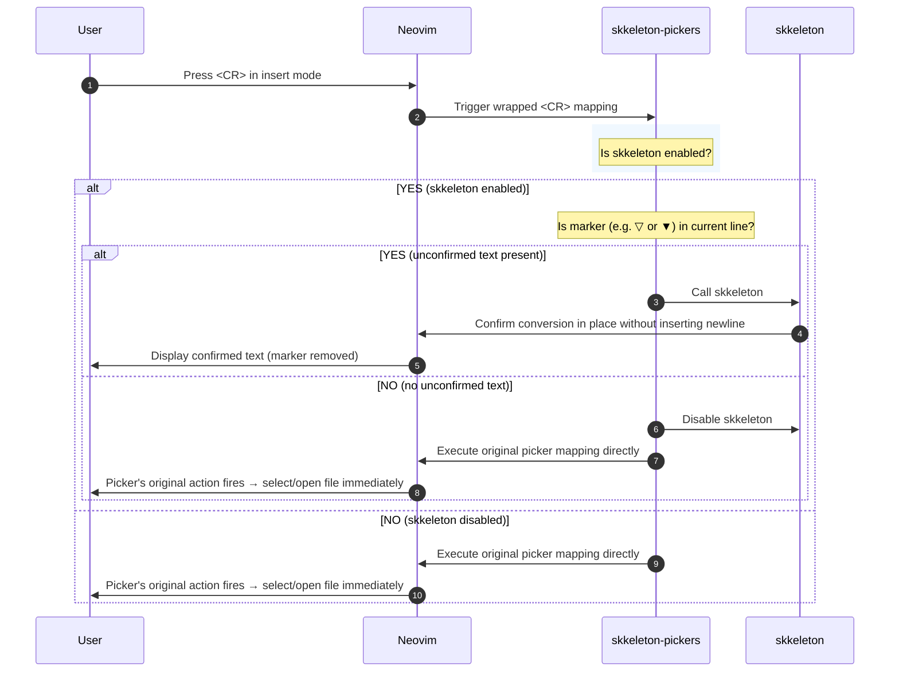

# skkeleton-pickers.nvim

`skkeleton-pickers.nvim` は、Neovim の主要な Fuzzy Finder（ファジーファインダー）のプロンプトバッファ内で、[skkeleton](https://github.com/vim-skk/skkeleton) を用いたシームレスな日本語入力を可能にするための Neovim プラグインです。

通常、ファジーファインダーのプロンプトでは SKK の挙動やモード管理が干渉しあうことがありますが、本プラグインを導入することで、検索ウィンドウの起動と同時に日本語入力（SKK）をストレスなくスムーズに利用できるようになります。

---

## 🚀 主な特徴

*   **シームレスな入力体験**: ピッカーが起動すると自動的に SKK モードが有効化され、即座に日本語で検索を開始できます。
*   **安全な `<CR>` (Enter) の移譲**: 変換未確定の文字列がある場合は skkeleton の確定（Kakutei）を行い、未確定文字列がない場合は本来のピッカーの決定処理（ファイルのオープンなど）を実行します。
*   **動的なマーカー追従**: `markerHenkan` や `markerHenkanSelect` などの skkeleton カスタムマーカー設定を動的に読み込み、どのようなマーカー（例: `▽` や `▼` 以外）を設定していても完璧に動作します。
*   **主要なファインダーに対応**: Telescope、Snacks.picker をサポート。

---

## ⚠️ Supported Fuzzy Finders

現在、本プラグインが公式にサポートしている Fuzzy Finder は**以下の3種類**です。

1. **Telescope** (`nvim-telescope/telescope.nvim`)
2. **Snacks.picker** (`folke/snacks.nvim`)
3. **mini.pick** (`echasnovski/mini.nvim`)

### 💡 mini.pick のサポートについて
`mini.pick` はその入力ループ処理において、通常のインサートモードのキーマッピングをバイパスし、低レベルな `vim.fn.getcharstr()` を用いて入力文字を直接傍受する設計となっています。
本プラグインでは、`vim.fn.getcharstr()` を動的にフック（monkeypatch）する手法を導入することで、`mini.pick` 起動中かつ skkeleton 有効化時のみキー入力を `skkeleton` 側にルーティングし、返ってきた確定/未確定テキストをピッカーのクエリ配列へとシームレスに同期しています。これにより、`mini.pick` でも完璧に日本語入力が可能になっています。

---

## Requirements

- Neovim >= 0.11.0 (組み込みパッケージマネージャ `vim.pack` を使用する場合は **Neovim >= 0.12.0**)
- [vim-denops/denops.vim](https://github.com/vim-denops/denops.vim)
- [vim-skk/skkeleton](https://github.com/vim-skk/skkeleton)

---

## Installation

### 1. lazy.nvim
```lua
{
  "hagatasdelus/skkeleton-pickers.nvim",
  dependencies = {
    "vim-skk/skkeleton",
    -- 各種お使いのファインダー
    -- "nvim-telescope/telescope.nvim",
    -- "folke/snacks.nvim",
    -- "echasnovski/mini.pick",
  },
  config = function()
    require("skkeleton-pickers").setup({
      -- 必要に応じたオプションをここに記述
    })
  end
}
```

### 2. mini.deps
```lua
local MiniDeps = require('mini.deps')

MiniDeps.add({
  source = 'hagatasdelus/skkeleton-pickers.nvim',
  depends = { 'vim-skk/skkeleton' },
})

require('skkeleton-pickers').setup({})
```

### 3. vim.pack (Neovim 0.12+)
```lua
vim.pack.add({
  source = "hagatasdelus/skkeleton-pickers.nvim",
  depends = { "vim-skk/skkeleton" },
})

require("skkeleton-pickers").setup({})
```

---

## Configuration

### 基本設定

```lua
require("skkeleton-pickers").setup({
  -- 特定のピッカーでのみ有効化したい場合は false に設定可能 (デフォルトはすべて true)
  telescope = true,
  snacks = true,
  mini_pick = true,

  -- 追加で有効にしたいカスタムバッファの filetype リスト
  filetypes = {},

  -- 各ファインダーのプロンプトに入った際のデフォルト動作
  -- "henkan" (即座にSKK変換モード), "zenkaku" (全角英数), "eisu" (直接入力), "katakana" (カタカナ) などを指定可能
  default_mode = "henkan", 

  -- skkeleton のトグルキー (デフォルトは "<C-j>")
  toggle_key = "<C-j>",
})
```

---

## 🔍 `<CR>` (Enter) 処理フロー

本プラグインは、プロンプト内での誤作動を防ぐために `<CR>` キー入力をインターセプトし、以下のロジックに従って適切にハンドリングします。



---

## 🛠️ 動的なマーカー追従について

skkeleton では、`markerHenkan` や `markerHenkanSelect` を利用して変換中のインジケータ記号を任意にカスタマイズできます。

```lua
-- 例: マーカーをブラケットに変更する設定
vim.fn["skkeleton#config"]({
  markerHenkan = "[",
  markerHenkanSelect = "]",
})
```

`skkeleton-pickers.nvim` は、バッファ上で決定キーが押された際、現在の `skkeleton` の構成情報を自動的に取得して Plain-text サーチを行います。そのため、ユーザーがどのようなカスタム記号を設定していても、未確定テキストの有無を正確に判定して誤動作なく動作します。特別なお手元の設定変更や追加オプションは不要です。

---

## License

MIT License
